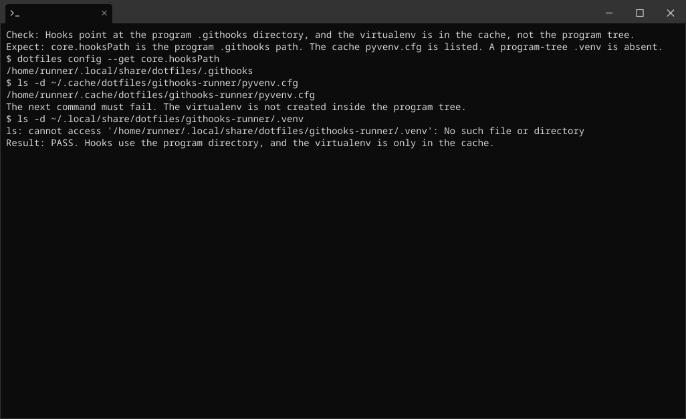
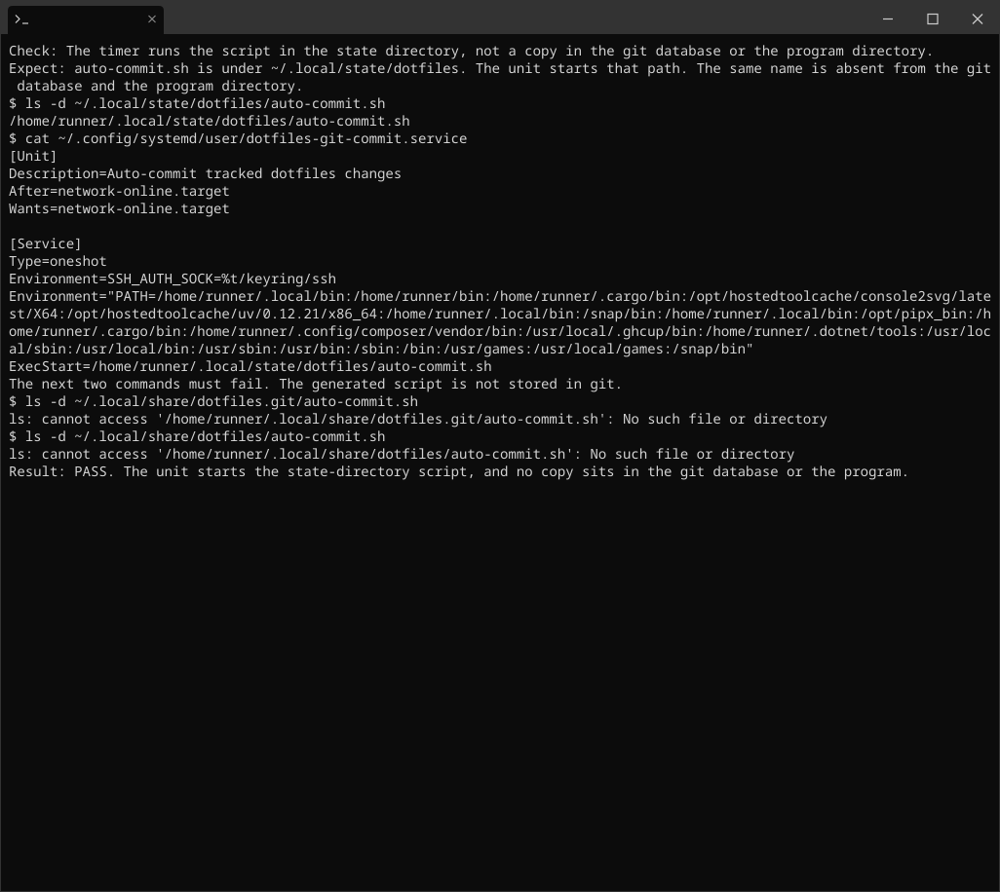
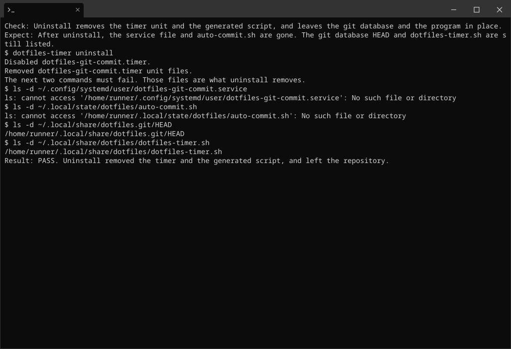

# Visual proof

Each recording is one check. The first line is the question. The second line is the output that means the product worked. The commands come next. The last line is `Result: PASS` only after those commands matched the expected output. A picture with no `Result: PASS` line did not pass.

A line that says the next command must fail means the error is the pass. A missing file, or an add that git refuses, is the result the check is looking for.

The names are the question, not a step number. `program-directory-and-git-database.svg` is the picture. The same basename with `.cast` is the terminal tape, and `.png` is a still rendered from that tape. The tape and the PNG are in the Actions artifact `visual-proof`. This page keeps the pictures that can live in the repository.

One check stays only in that artifact: `separate-database-program-and-baseline`. Its tape prints the retired home directory, and that path is not stored in this repository. The question and the pass rule are below, so the artifact is readable on its own. This file is copied into the artifact next to the pictures.

The laptop in every recording is on branch `laptop`. The baseline it merges is `system`. The host default is `main`. The recording ran on a GitHub-hosted runner, so home is `/home/runner` and a push reports a local remote path.

## program-directory-and-git-database

Check: the program directory and the git database are both present, and this machine is on branch laptop.

Expect: `ls` lists `dotfiles/` and `dotfiles.git/`. `dotfiles status -sb` prints `## laptop`.

Pass: both directory names appear, and the status line contains `## laptop`.

Fail: either directory is missing, or the status line does not contain `## laptop`.

## track-home-bashrc

Check: a new `~/.bashrc` is ignored until `add -f`, then the commit and push stay on branch laptop.

Expect: `check-ignore` prints the ignore rule. `add` without `-f` says the path is ignored. Status still prints `## laptop`.

Pass: the plain add fails, `add -f` and the commit succeed, and status stays on laptop.

Fail: the plain add succeeds, the ignore rule is missing, or the status line does not contain `## laptop`.

## commit-bashrc-edit

Check: a later edit of the tracked `~/.bashrc` is committed with `add -u`, and the branch stays laptop.

Expect: `diff` shows `export EDITOR=vim`. `log --stat` names `.bashrc`. Status still prints `## laptop`.

Pass: the diff contains that line, the commit stat lists `.bashrc`, and the branch line still contains `## laptop`.

Fail: the diff lacks that line, the commit does not name `.bashrc`, or the branch line changed.

## doctor-hard-checks

Check: `dotfiles-doctor` passes every hard check when the network check is skipped.

Expect: the hooks directory and the cache `pyvenv.cfg` exist, and doctor prints `all hard checks PASSED`.

Pass: that PASSED line is present, and no hard check prints `FAIL`.

Fail: any hard check prints `FAIL`, or the PASSED line is missing.

## update-merges-system-branch

Check: `dotfiles-update` merges branch `system` onto laptop and does not bring the file that exists only on `main`.

Expect: the update merges `origin/system`. `SYSTEM_ONLY.txt` says `only on the named baseline`. Status is `## laptop`. `~/DEFAULT_ONLY.txt` is missing.

Pass: the baseline file is listed and its text matches, the branch line still contains `## laptop`, and the listing of the main-only file fails.

Fail: `SYSTEM_ONLY.txt` is missing or has different text, the branch line changed, or `DEFAULT_ONLY.txt` exists in the home directory.

## timer-script-commits-bashrc

Check: the generated timer script commits a tracked `~/.bashrc` edit and pushes it on branch laptop.

Expect: `diff` shows `# left the desk`. The script names `.bashrc` and does not say `Everything up-to-date`. `log --stat` names `.bashrc`.

Pass: `cat` still shows the desk line, status contains `## laptop`, and the remote laptop commit matches HEAD.

Fail: the script has nothing new to push, the remote laptop commit does not move, or the desk line is gone.

## hook-venv-lives-in-cache

Check: hooks point at the program `.githooks` directory, and the virtualenv is in the cache, not the program tree.

Expect: `core.hooksPath` is the program `.githooks` path. The cache `pyvenv.cfg` is listed. A program-tree `.venv` is absent.

Pass: the config path matches, the cache file is listed, and the program-tree listing fails.

Fail: `hooksPath` differs, `pyvenv.cfg` is missing, or a `.venv` exists inside the program tree.

## timer-script-lives-in-state

Check: the timer runs the script in the state directory, not a copy in the git database or the program directory.

Expect: `auto-commit.sh` is under `~/.local/state/dotfiles`. The unit starts that path. The same name is absent from the git database and the program directory.

Pass: the state path is listed, the unit names it, and both other listings fail.

Fail: the state script is missing, the unit names another path, or a copy exists in the git database or the program directory.

## uninstall-removes-timer-keeps-repo

Check: uninstall removes the timer unit and the generated script, and leaves the git database and the program in place.

Expect: after `dotfiles-timer uninstall`, the service file and `auto-commit.sh` are gone. The git database `HEAD` and `dotfiles-timer.sh` are still listed.

Pass: the two removed paths fail to list, and the two kept paths are listed.

Fail: the unit or the state script remains, or `HEAD` or `dotfiles-timer.sh` is gone.

## separate-database-program-and-baseline

This picture is only in the Actions artifact `visual-proof`, under this same name. Open that file for the commands. The tape shows a path this repository does not store: the retired home directory, which setup must not create.

Check: the git database, the program directory, and the host default are separate, and `add -A` stages nothing.

Expect: the branch is laptop, `systemRef` is `system`, the remote default is `refs/heads/main`, the program has no `HEAD`, the retired directory is absent, and the cached diff status is `0`.

Pass: present paths are listed, the two paths that must be missing print an error, the status is `0`, and `check-ignore` names the git database.

Fail: the remote default is `system`, a path that must be missing is present, the status is not `0`, or `check-ignore` does not name the git database.
