# dotfiles-template

Manage dotfiles across machines using a bare git repository. No symlinks, no extra tools — just git.

The trick: a bare repo stored at `~/.local/share/dotfiles.git` with `$HOME` as its work-tree, accessed via a short alias. The program itself is checked out at `~/.local/share/dotfiles/`. Generated timer scripts and logs live in `~/.local/state/dotfiles/`. The hook virtualenv lives in `~/.cache/dotfiles/githooks-runner/`. These paths are the same on Linux, macOS, and Windows. `git clean -fdx` from `$HOME` deletes ignored files, including the bare repo. Do not run it on an install.

> `**<placeholder>**` — anything in angle brackets is something you must replace with your own value before running the command.

> ⚠️ **Never track secret files.** With auto-commit enabled, any tracked file is pushed within 60 seconds of being modified. The included `.gitignore` blocks the most common ones (`.ssh/id_`*, `.netrc`, `.aws/credentials`, `.env`*, `*.pem`, `*.key`) defensively. Audit before running `dotfiles add` on anything new.

---

## The `dotfiles` command

Add one of these to your shell profile and use `dotfiles` everywhere you'd use `git`:

**Bash / Zsh** (`~/.bashrc` or `~/.zshrc`):

```bash
alias dotfiles='git --git-dir=$HOME/.local/share/dotfiles.git/ --work-tree=$HOME'
```

**PowerShell** (`$PROFILE`):

```powershell
function dotfiles { git --git-dir="$HOME/.local/share/dotfiles.git/" --work-tree="$HOME" @args }
```

---

## Using this template (no fork required)

You don't need to fork on GitHub. Clone directly, set up your own repo, then bring it down to your machine as a bare repo.

### 1. Create your own GitHub repo from this template

`dotfiles update` merges a **named branch** (`dotfiles.systemRef`, default `system`). It does not follow `origin/HEAD`. Any name `git check-ref-format --branch` accepts is allowed, including `main` or `master`. Tools that cannot pick a branch still write whatever GitHub calls default; that only becomes the merge source if you set `dotfiles.systemRef` to that name.

Create an empty GitHub repo, then push the template onto the baseline branch you chose:

```bash
# Any valid branch name. Existing baselines that already live on master:
#   SYSTEM_REF=master
SYSTEM_REF=system

gh repo create <YOU>/dotfiles --private --empty

git clone https://github.com/DgxSparkLabs/dotfiles-template.git dotfiles
cd dotfiles

git remote remove origin
git remote add origin https://github.com/<YOU>/dotfiles.git

# Push the host default first when the repo is empty, so the first push does
# not become the only branch. Then push the baseline under the name you chose.
git push -u origin HEAD:main
git push origin "HEAD:$SYSTEM_REF"
```

Or if you prefer a fresh history (no template commits):

```bash
SYSTEM_REF=system
git clone https://github.com/DgxSparkLabs/dotfiles-template.git dotfiles
cd dotfiles
rm -rf .git
git init
git add .
git commit -m "Initial dotfiles setup"
git remote add origin https://github.com/<YOU>/dotfiles.git
git push -u origin HEAD:main
git push origin "HEAD:$SYSTEM_REF"
```

`$SYSTEM_REF` is what `dotfiles update` merges from. Pass the same name to bootstrap (`--system-ref` / `-SystemRef`). An instance that already uses `master` as the baseline keeps that branch and sets `dotfiles.systemRef` to `master`.

> **Why not fork?** Forks stay linked to the upstream repo on GitHub, which can clutter your profile and creates an implicit relationship you probably don't want for personal dotfiles.

### 2. Set up the bare repo on this machine

```bash
SYSTEM_REF=system   # or master, or any other valid branch name
git clone --bare git@github.com:<YOU>/dotfiles.git $HOME/.local/share/dotfiles.git
dotfiles config --local status.showUntrackedFiles no
dotfiles config --local dotfiles.systemRef "$SYSTEM_REF"

# Populate $HOME from the baseline branch
dotfiles checkout "$SYSTEM_REF" -- .gitignore .local/share/dotfiles/
dotfiles add -u . && dotfiles commit -m "Init dotfiles"
```

Verify the work-tree is fully in sync:

```bash
dotfiles status
```

### 3. Create this machine's branch

This template uses **one branch per machine**. The baseline branch (`$SYSTEM_REF`, default `system`) holds the template's portable defaults (the `.gitignore`, the git-hook stubs, the auto-commit timer, the wrapper definitions). It is not a shared bucket for your personal content; nothing you add on a machine branch is meant to travel back into the baseline.

The flow is **one-way**: baseline → your machine branch, pulled with `dotfiles update`. Your machine branch is where *your* dotfiles live, and they stay there. Any valid branch name is fine for either role. See [The partition contract](#the-partition-contract-system-vs-user) below for what belongs where.

Pick a short, descriptive name for each machine:


| `<machine-name>`                 | Use for                                        |
| -------------------------------- | ---------------------------------------------- |
| `desktop-home`, `desktop-work`   | Stationary desktops, distinguished by location |
| `laptop-personal`, `laptop-work` | Laptops, distinguished by ownership            |
| `vm-dev`, `wsl-ubuntu`           | Virtual machines and WSL distros               |
| `server-home`, `vps-prod`        | Remote servers                                 |


> Confirm `dotfiles status` is clean from step 2 before proceeding — otherwise any staged deletions follow into the new branch and your first commit there will silently delete those files from the baseline.

```bash
dotfiles checkout -b <machine-name> "$SYSTEM_REF"
dotfiles push -u origin <machine-name>

# Suggestion for windows
dotfiles checkout -b $((Get-WmiObject -class Win32_BaseBoard).product) $SYSTEM_REF
dotfiles push -u origin $((Get-WmiObject -class Win32_BaseBoard).product)

# Suggestion for linux
dotfiles checkout -b $(cat /sys/class/dmi/id/board_name) "$SYSTEM_REF"
dotfiles push -u origin $(cat /sys/class/dmi/id/board_name)

# Suggestion for WSL
dotfiles checkout -b WSL "$SYSTEM_REF"
dotfiles push -u origin WSL
```

### 4. Add your dotfiles

```bash
dotfiles add -f ~/.bashrc
dotfiles commit -m "Add bashrc"
dotfiles push
```

The root ignore hides the rest of `$HOME`, so the first add of a new file uses `-f`. After that, `dotfiles add -u` and the timer see it.

For the ongoing per-machine workflow, see [Multiple machines](#multiple-machines).

---

## Daily use

You stay on your machine branch. Shared defaults stay on the baseline branch from step 1 (`system`, unless you set `dotfiles.systemRef` to another name). GitHub can keep `main` as its default. [`dotfiles-update`](#system-updates-dotfiles-update) merges the baseline you named.

The pictures are a laptop whose branch is `laptop`. Each picture is the command block above it, in that order. Run them from any directory; `dotfiles` always uses `$HOME` as the work tree. This recording ran on a GitHub-hosted runner, so the home directory in the pictures is `/home/runner` and `dotfiles push` reports a local remote path.

**Two directories.** `ls` lists `dotfiles/` (the scripts) and `dotfiles.git/` (the git database: `HEAD`, `objects`, `refs`). `dotfiles status -sb` prints this machine's branch.

```bash
ls -F ~/.local/share
ls -F ~/.local/share/dotfiles.git
ls -F ~/.local/share/dotfiles
dotfiles status -sb
```



**Track `~/.bashrc`.** `ls` and `cat` show the file. `dotfiles add` is rejected because the root ignore hides it. `dotfiles add -f` tracks it, the commit records it, and the push sets the upstream.

```bash
ls -l ~/.bashrc
cat ~/.bashrc
dotfiles check-ignore -v ~/.bashrc
dotfiles add ~/.bashrc
dotfiles add -f ~/.bashrc
dotfiles commit -m "Add bashrc"
dotfiles push -u origin HEAD
dotfiles status -sb
```



**Save an edit.** `cat` shows the `EDITOR` line. `dotfiles diff` is that change. `dotfiles log -1 --stat` names `.bashrc`, and `dotfiles status -sb` is still `laptop`.

```bash
cat ~/.bashrc
dotfiles diff ~/.bashrc
dotfiles add -u .
dotfiles commit -m "Set EDITOR"
dotfiles log -1 --stat
dotfiles status -sb
```



**Check the laptop.** The hooks directory and the cache virtualenv are on disk. [`dotfiles-doctor --skip-network`](#health-check-dotfiles-doctor-optional) prints a PASS for each hard check.

```bash
ls -d ~/.local/share/dotfiles/.githooks
ls -l ~/.cache/dotfiles/githooks-runner/pyvenv.cfg
dotfiles-doctor --skip-network
```



**Take the baseline.** `dotfiles-update` merges branch `system`. `ls` and `cat` show `SYSTEM_ONLY.txt`, the file that merge wrote. `dotfiles status -sb` is still `laptop`. What belongs on each branch is the [partition contract](#the-partition-contract-system-vs-user).

```bash
dotfiles-update
ls -l ~/.local/share/dotfiles/SYSTEM_ONLY.txt
cat ~/.local/share/dotfiles/SYSTEM_ONLY.txt
dotfiles log -1 --stat
dotfiles status -sb
```


**Leave the desk.** The [timer](#auto-commit-optional) is installed. `printf` appends a line, `dotfiles diff` is that line, and `~/.local/state/dotfiles/auto-commit.sh` (the script the timer runs) commits it and pushes. `cat` still shows the line. A new file still needs one `dotfiles add -f` before that script can see it.

```bash
printf '\n# left the desk\n' >> ~/.bashrc
dotfiles diff ~/.bashrc
ls -l ~/.local/state/dotfiles/auto-commit.sh
bash ~/.local/state/dotfiles/auto-commit.sh
cat ~/.bashrc
dotfiles log -1 --stat
dotfiles status -sb
```



### Auto-commit (optional)

Automatically stage and push changes on a schedule. By default the generated script runs **`git add -u`** (tracked paths only). **`dotfiles-timer install --all`** (Linux: `--all`/`-A`; Windows: `-AddAll`) embeds **`git add -A`**, which also stages untracked files that are not ignored. Paths hidden by the root ignore, including a new file in `$HOME`, still need one `dotfiles add -f` before either form can see them.

Add a `dotfiles-timer` wrapper to your shell profile (same pattern as the `dotfiles` function above) so the install/uninstall/status commands are identical across all your machines:

**Bash / Zsh** (`~/.bashrc` or `~/.zshrc`):

```bash
alias dotfiles-timer='bash $HOME/.local/share/dotfiles/dotfiles-timer.sh'
```

**PowerShell** (`$PROFILE`):

```powershell
function dotfiles-timer { pwsh "$HOME/.local/share/dotfiles/dotfiles-timer.ps1" @args }
```

Then on any platform:

```text
dotfiles-timer install      # write files, enable autostart, start now
dotfiles-timer reinstall    # uninstall + install
dotfiles-timer enable       # turn on autostart (don't necessarily run now)
dotfiles-timer disable      # turn off autostart and stop (keep files)
dotfiles-timer start        # run now (idempotent — also enables if disabled)
dotfiles-timer stop         # stop running now (transient — auto-resumes on reboot if enabled)
dotfiles-timer status       # show install + autostart + running state
dotfiles-timer logs         # show recent activity
dotfiles-timer uninstall    # full removal (alias: remove)
```

Behavior per platform:

- **Linux** — installs a systemd user timer that runs every minute.
- **Windows admin shell** — registers a Task Scheduler task. Survives logoff, runs as your user with limited rights.
- **Windows non-admin shell** — drops a hidden VBS launcher in your Startup folder that fires a detached `pwsh` while-loop at each logon. No admin required, no console window flash (the VBS host is windowless). Errors log to `~/.local/state/dotfiles/auto-commit.log`.

The commit script (and the loop script, in Windows user mode) lives in `~/.local/state/dotfiles/`, which is gitignored, so both stay off `dotfiles status`. systemd user units stay in `~/.config/systemd/user/` (a user manager started with `XDG_CONFIG_HOME` set will not load them). The macOS plist stays in `~/Library/LaunchAgents/`. The Windows launcher stays in the Startup folder.

### Git hooks (optional)

Client-side hooks run as **POSIX `#!/bin/sh` stubs** under `~/.local/share/dotfiles/.githooks/` (tracked in this repo as **`.local/share/dotfiles/.githooks/`**). Each stub executes the same **Python dispatcher** via **`uv run`** — no `pre-commit` framework dependency.

**Prerequisites**

- **[uv](https://docs.astral.sh/uv/)** on `PATH` wherever Git runs hooks (terminal **and** GUI clients often inherit a minimal PATH — if hooks fail to find `uv`, fix PATH or edit the POSIX stubs under `.local/share/dotfiles/.githooks/` to invoke a full path to `uv`).
- **Linux / macOS**: normal system `sh`.
- **Windows**: **Git for Windows** (hooks are executed with **`sh.exe`** from Git’s MSYS environment).

The hook launcher scripts under **`.local/share/dotfiles/.githooks/`** are **tracked in this repo** (no separate generator step). After your work-tree contains `.local/share/dotfiles/`, sync the Python package once. The virtualenv is not created inside the project:

```bash
export UV_PROJECT_ENVIRONMENT="$HOME/.cache/dotfiles/githooks-runner"
uv sync --project "$HOME/.local/share/dotfiles/githooks-runner"
```

**Point the bare repo at the hooks directory** (required — hooks live in the checkout, outside the git dir):

```bash
git --git-dir "$HOME/.local/share/dotfiles.git" config core.hooksPath "$HOME/.local/share/dotfiles/.githooks"
```

Verify with:

```bash
git --git-dir "$HOME/.local/share/dotfiles.git" config --show-origin core.hooksPath
```

**Optional logging**

Set `DOTFILES_GITHOOKS_VERBOSE=1` to print a line to stderr for every hook invocation (default is silent).

### Per-machine git identity (optional)

Keep machine-specific identity — your email, signing key — out of the common config so it can vary per machine while applying to **all** git work. The common/base `~/.gitconfig` ends with a plain `[include]` of an untracked, per-machine `~/.gitconfig.local`; each machine sets its own email there (work email on the work laptop, personal at home).

The repo ships `.local/share/dotfiles/gitconfig.example` as the common base. Copy it to `~/.gitconfig`, then create the per-machine `~/.gitconfig.local`:

**Bash / Zsh:**

```bash
cp ~/.local/share/dotfiles/gitconfig.example ~/.gitconfig

printf '[user]\n\temail = <you@example.com>\n' > ~/.gitconfig.local
```

**PowerShell:**

```powershell
Copy-Item "$HOME/.local/share/dotfiles/gitconfig.example" "$HOME/.gitconfig"
"[user]`n`temail = <you@example.com>" | Set-Content "$HOME\.gitconfig.local"
```

Then verify it resolves in any repo:

```bash
git config --get user.email      # -> <you@example.com>
```

> The `~/.gitconfig.local` file is **per-machine and untracked** — create it on every machine. If it's missing, git silently skips the include and `user.email` is simply unset, so commits will fail to identify you until you create it.

### Health-check: `dotfiles doctor` (optional)

`dotfiles doctor` runs a battery of setup checks and prints **PASS / FAIL / INFO** with an actionable fix hint for each. It exits non-zero if any hard check fails, so it doubles as a CI/bootstrap gate. It is **pure shell / pwsh** — deliberately *not* run through the `uv` hook runner, so a broken `uv` install is still diagnosable.

Checks performed:

- **uv** is on `PATH`
- `core.hooksPath` == `~/.local/share/dotfiles/.githooks`
- `status.showUntrackedFiles` == `no`
- the `githooks-runner` venv is synced
- the work-tree is clean (no uncommitted tracked changes)
- current HEAD (INFO)
- `dotfiles.systemRef` is a valid branch name (default `system`) (INFO, or FAIL if the configured string is not a branch name)
- `user_hooks.example` / `user_hooks.py` activation state (INFO only)
- auto-commit timer state (INFO only)
- remote push/fetch reachability — network + SSH auth (skippable)

Add a `dotfiles-doctor` wrapper to your shell profile (same pattern as the other wrappers):

**Bash / Zsh** (`~/.bashrc` or `~/.zshrc`):

```bash
alias dotfiles-doctor='bash $HOME/.local/share/dotfiles/dotfiles-doctor.sh'
```

**PowerShell** (`$PROFILE`):

```powershell
function dotfiles-doctor { pwsh "$HOME/.local/share/dotfiles/dotfiles-doctor.ps1" @args }
```

Then on any platform:

```text
dotfiles-doctor                  # run all checks
dotfiles-doctor --skip-network   # Bash/Zsh: omit the network/SSH reachability check
dotfiles-doctor -SkipNetwork     # PowerShell: omit the network/SSH reachability check
```

The git dir defaults to `$HOME/.local/share/dotfiles.git` and the work-tree to `$HOME`. The expected program directory is `$WORK_TREE/.local/share/dotfiles`. State and the uv cache stay under `$HOME`. Override the git dir and work-tree with arguments if your setup differs:

```text
dotfiles-doctor --git-dir /path/to/repo --work-tree /path/to/home   # Bash/Zsh
dotfiles-doctor -GitDir C:\path\to\repo -WorkTree C:\path\to\home    # PowerShell
```

Use `--skip-network` / `-SkipNetwork` when offline or when the SSH agent is locked — otherwise the reachability check would false-FAIL.

### Shell completion (optional)

Tab-completion for the wrappers lives in `.local/share/dotfiles/completions/`. `dotfiles` completes exactly like `git`; `dotfiles-timer` completes its verbs (`install`, `reinstall`, `enable`, `disable`, `start`, `stop`, `status`, `logs`, `uninstall`, `remove`) and the add-all flags (`--all`/`-A` on Linux, `-AddAll` on Windows); `dotfiles-update` completes `--auto` and `dotfiles-doctor` completes `--skip-network`.

Source the file for your shell **after** defining the wrapper alias/function:

**Bash** (`~/.bashrc`):

```bash
source "$HOME/.local/share/dotfiles/completions/dotfiles.bash"
```

**Zsh** (`~/.zshrc`, after `compinit`):

```zsh
fpath+=("$HOME/.local/share/dotfiles/completions")
source "$HOME/.local/share/dotfiles/completions/dotfiles.zsh"
```

**PowerShell** (`$PROFILE`):

```powershell
. "$HOME/.local/share/dotfiles/completions/dotfiles.ps1"
```

> **Prereq for `dotfiles` git completion.** `dotfiles` reuses git's own completion: bash needs git's bash-completion script loaded (so `__git_complete`/`__git_main` exist); zsh needs `_git`; PowerShell needs git's completer (e.g. [posh-git](https://github.com/dahlbyk/posh-git) or recent Git for Windows). If that script isn't present the `dotfiles` completion silently no-ops — the timer/update/doctor completions still work.

### Submodules (optional)

> ⚠️ **Known limitation:** submodule operations (`add`, `init`, `update`) don't always compose cleanly with the bare-repo `--git-dir`/`--work-tree` pattern — a long-standing git issue. The instructions below work for many users but may fail on some git versions. If you hit errors, alternatives include committing the files directly or using a tool like `chezmoi` that has first-class submodule support.
>
> Reference (may become stale): [git mailing list discussion, 2012](https://www.spinics.net/lists/git/msg185334.html)

For shell plugins or large tool dotfiless, use submodules instead of copying files:

```bash
dotfiles submodule add https://github.com/zsh-users/zsh-autosuggestions ~/.zsh/zsh-autosuggestions
```

On a new machine after cloning:

```bash
dotfiles submodule init
dotfiles submodule update
```

---

## Managing `.gitignore`

The root ignore starts with `/*`, then re-includes one parent at a time so the only trackable tree is `.gitignore` itself and `.local/share/dotfiles/`. Everything else in `$HOME`, hidden or not, stays ignored. That is why the first `dotfiles add` of a home file uses `-f`. `dotfiles status` stays quiet because bootstrap sets `status.showUntrackedFiles` to `no`.

A normal add also skips the secret names listed at the bottom of that file (`.ssh/id_*`, `.netrc`, `.aws/credentials`, `.env`, `*.pem`, `*.key`). `add -f` overrides the ignore, which is why the warning at the top says to audit before forcing a path.

To track another directory (for example `~/bin`), add a negation to the root `.gitignore` and commit it. A `.gitignore` inside an ignored directory is never read.

```bash
# in ~/.gitignore, after the existing chain:
!/bin/
!/bin/**

dotfiles add ~/.gitignore
dotfiles commit -m "Unignore ~/bin"
dotfiles add ~/bin
```

---

## Multiple machines

Use **one branch per machine**. The baseline branch holds template-level defaults. Its name is `dotfiles.systemRef` (default `system`; any valid branch name, including `main` or `master`). Each machine branch is created off that baseline once (step 3). After that, `dotfiles-update` pulls baseline improvements down onto the machine branch.

```bash
# Pull baseline improvements onto this machine
dotfiles-update
```

`dotfiles-update` merges `origin/<dotfiles.systemRef>` onto your current branch. It follows that config, which defaults to `system`. It does not follow `origin/HEAD`. Confirm the work-tree is clean first (`dotfiles status`, or [`dotfiles doctor`](#health-check-dotfiles-doctor-optional)) — the same precaution called out in [step 3](#3-create-this-machines-branch).

If this instance already keeps the baseline on `master`:

```bash
dotfiles config --local dotfiles.systemRef master
```

### The partition contract (system vs user)

**System** content lives on the baseline branch and flows down to every machine. **User** content lives on the machine branch. The branch names are yours; `dotfiles update` uses the configured name.

| Concern | Lives in | Owned by | Travels via |
| --- | --- | --- | --- |
| System baseline — `.gitignore`, hook stubs, timer, wrappers | `dotfiles.systemRef` (default `system`) | the template | `dotfiles update` (baseline → machine, one-way) |
| Your custom git-hook logic | `user_hooks.py` | you | stays on your machine branch |
| Your git identity (name, email, signing key) | `~/.gitconfig.local`, pulled in via `[include]` | you | stays on your machine branch |
| Your dotfiles, app configs, machine tweaks | your machine branch | you | stays on your machine branch |

Custom hook behavior goes in **`user_hooks.py`** (a user extension point the system dispatcher calls — see [Git hooks](#git-hooks-optional)) rather than editing the tracked stubs, so a `dotfiles update` leaves it alone when that file is only on the machine branch. Identity stays in **`~/.gitconfig.local`**, pulled in by a plain `[include]` directive in the tracked `.gitconfig`, so each machine's identity is local and untracked.

> **Sharing content between machines is a separate flow.** Machine-to-machine sharing of *user* content is the planned **`sync`** feature. Committing personal files onto the baseline branch sends them to every machine on the next `dotfiles update`.

### System updates (`dotfiles-update`)

`dotfiles update` fetches `origin/<dotfiles.systemRef>` and merges that baseline onto your machine branch. Because you keep system-file edits on the baseline, the merge is normally clean. If it conflicts (a baseline file overlaps one you edited on the machine), the command prints a loud message, lists the conflicting files, **aborts the merge** (leaving your work-tree clean), and exits non-zero.

It runs manually by default; pass `--auto` (Linux) / `-Auto` (Windows) for unattended use from a scheduled wrapper (same merge semantics).

Add a `dotfiles-update` wrapper to your shell profile (same pattern as `dotfiles-timer`):

**Bash / Zsh** (`~/.bashrc` or `~/.zshrc`):

```bash
alias dotfiles-update='bash $HOME/.local/share/dotfiles/dotfiles-update.sh'
```

**PowerShell** (`$PROFILE`):

```powershell
function dotfiles-update { pwsh "$HOME/.local/share/dotfiles/dotfiles-update.ps1" @args }
```

Then on any platform:

```text
dotfiles-update            # fetch the configured baseline + merge into this machine's branch
dotfiles-update --auto     # same, opt-in unattended (Windows: -Auto)
```

### Adding another machine

Repeat [Using this template](#using-this-template-no-fork-required) **steps 2–4** on the new machine, picking a new `<machine-name>` in step 3. Step 1 (creating the GitHub repo) only happens once, on your first machine.

If a branch for this machine already exists on the remote (e.g. you set it up before and are reinstalling), substitute step 3 with:

```bash
dotfiles checkout <machine-name>     # checkout the existing branch instead of creating one
```

For full disaster-recovery automation, see [Restoring a machine from scratch](#restoring-a-machine-from-scratch).

---

## Restoring a machine from scratch

The `dotfiles` alias lives in your profile — which hasn't been restored yet. The tracked bootstrap scripts define it temporarily, clone your bare repo, then check out your machine's branch (which restores the profile). They live in your repo at [`.local/share/dotfiles/bootstrap.sh`](.local/share/dotfiles/bootstrap.sh) and [`.local/share/dotfiles/bootstrap.ps1`](.local/share/dotfiles/bootstrap.ps1).

Both take the repo URL and (optionally) the branch as **command-line parameters**:

| Parameter | Required | Default |
| --- | --- | --- |
| repo (`--repo` / `-Repo`) | yes (fails fast if missing) | — |
| branch (`--branch` / `-Branch`) | no | auto-detected machine name, **confirmed interactively** — Linux `/sys/class/dmi/id/board_name`, WSL → `WSL`, Windows `(Get-WmiObject Win32_BaseBoard).product`, else hostname |
| baseline (`--system-ref` / `-SystemRef`) | no | `system` — any valid branch name; written to `dotfiles.systemRef`. The branch must already exist on the remote |
| auto-accept (`-y` / `--yes` / `-Yes`) | no | off — when set, auto-accepts the auto-detected branch without prompting |

If you don't pass a branch, the script auto-detects this machine's name and asks you to confirm it (press Enter) or type a different branch before applying. In a non-interactive context (no TTY, e.g. CI) it errors and tells you to pass the branch explicitly, rather than hanging on the prompt. Input comes only from command-line arguments — there are no environment-variable fallbacks.

Branch resolution follows this precedence: an explicit `--branch`/`-Branch` always wins; otherwise with `-y`/`--yes` (`-Yes` on PowerShell) the script auto-accepts the auto-detected machine name **without prompting** (and without the non-interactive error); otherwise on an interactive terminal it prompts; otherwise (no branch, no `-y`, no TTY) it errors and exits. Use `-y` for unattended/scripted setup on a machine whose detected name is already the branch you want — it skips the confirmation while staying argument-only.

On a fresh machine you only have the script (copy it over, or fetch it from your repo's web UI). Run:

**Bash / WSL / Linux:**

```bash
bash bootstrap.sh --repo git@github.com:<YOU>/dotfiles.git
# you'll be asked to confirm the detected branch, or:
bash bootstrap.sh --repo git@github.com:<YOU>/dotfiles.git --branch my-laptop
# baseline branch other than the default name "system" (must already exist on the remote):
bash bootstrap.sh --repo git@github.com:<YOU>/dotfiles.git --branch my-laptop --system-ref master
# auto-accept the detected branch (no prompt):
bash bootstrap.sh --repo git@github.com:<YOU>/dotfiles.git -y
# positional form also works:
bash bootstrap.sh git@github.com:<YOU>/dotfiles.git my-laptop
```

**PowerShell (Windows):**

```powershell
pwsh bootstrap.ps1 -Repo git@github.com:<YOU>/dotfiles.git
# you'll be asked to confirm the detected branch, or:
pwsh bootstrap.ps1 -Repo git@github.com:<YOU>/dotfiles.git -Branch my-laptop
# baseline branch other than the default name "system":
pwsh bootstrap.ps1 -Repo git@github.com:<YOU>/dotfiles.git -Branch my-laptop -SystemRef master
# auto-accept the detected branch (no prompt):
pwsh bootstrap.ps1 -Repo git@github.com:<YOU>/dotfiles.git -y
```

Conflicting OS-default files are backed up to `*.bak` before checkout, so nothing is lost. After checkout the scripts set `status.showUntrackedFiles no` and `dotfiles.systemRef` to `--system-ref` (default `system`). The machine branch and the baseline name only have to be valid branch names. Open a new shell (or reload your profile) so the `dotfiles` wrapper is available.

---

## Uninstalling — completely remove this dotfiles system

If you decide to stop using this approach, here's how to clean up everything on a single machine.

### 1. Stop and uninstall the auto-commit timer (if installed)

```bash
dotfiles-timer uninstall    # both Linux and Windows; alias: remove
```

### 2. List what's currently tracked (so you know what'll change)

```bash
dotfiles ls-tree -r HEAD --name-only
```

Save the list somewhere if you want to keep a record of what files were managed.

### 3. Remove the bare repo

**Linux / macOS:**

```bash
rm -rf ~/.local/share/dotfiles.git ~/.local/state/dotfiles ~/.cache/dotfiles
```

**Windows (PowerShell):**

```powershell
Remove-Item -Recurse -Force "$HOME/.local/share/dotfiles.git", "$HOME/.local/state/dotfiles", "$HOME/.cache/dotfiles"
```

After this, the `dotfiles` and `dotfiles-timer` wrappers in your shell profile still exist but no longer point at anything functional.

### 4. (Optional) Decide what to do with the tracked files in `$HOME`

The actual content (`.bashrc`, `.gitdotfiles`, etc.) is **plain files in `$HOME`**, not symlinks — removing the bare repo doesn't delete them. Choose:

- **Keep them** — most users want this. The files just stop being version-controlled and otherwise behave normally.
- **Restore OS defaults** — manually delete or replace each file from the list in step 2.

### 5. Remove the wrapper definitions from your shell profile

Edit your shell profile and delete these lines:

**Bash / Zsh** (`~/.bashrc` or `~/.zshrc`):

```bash
alias dotfiles=
alias dotfiles-timer=
```

**PowerShell** (`$PROFILE`):

```powershell
function dotfiles {
function dotfiles-timer {
```

### 6. (Optional) Clean up the auto-commit log

`dotfiles-timer uninstall` deletes the logs in `~/.local/state/dotfiles/`. If you removed the timer by hand:

```bash
rm -f ~/.local/state/dotfiles/auto-commit.log ~/.local/state/dotfiles/stdout.log ~/.local/state/dotfiles/stderr.log
```

Linux systemd also records the timer in the user journal (`journalctl --user -u dotfiles-git-commit.service`), which has its own retention.

### 7. Reload your shell

**Bash / Zsh:**

```bash
exec $SHELL
```

**PowerShell:** open a new terminal, or:

```powershell
. $PROFILE
```

### 8. (Optional) Delete the GitHub repo

This is irreversible — only do it if you want to fully erase the cloud copy across all your machines:

```bash
gh repo delete <YOU>/dotfiles --yes
```

Or via the GitHub UI: **Settings → Danger Zone → Delete this repository**.